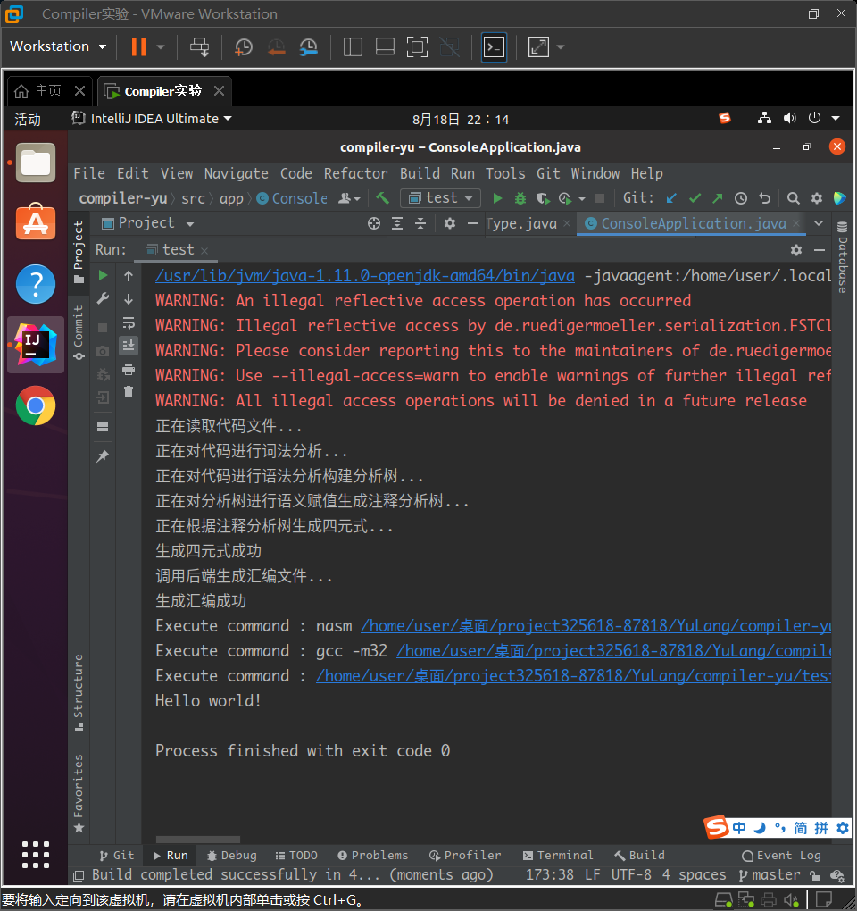

# `NK-伏羲-X`

这是[2021全国大学生计算机系统能力大赛 - 操作系统赛- 功能设计赛道](https://course.educg.net/sv2/indexexp/contest/contest.jsp?doVisit=true&contestID=qozAYR5kOWE&my=false&contestCID=0)的NK-伏羲-X队伍中使用Java实现的Yu语言的编译器。

该选题由[MaxXSoft](https://github.com/MaxXSoft)命题，可以在[此处](https://github.com/oscomp/proj5-fuxi-full-system-with-cpu-compiler-os)查看其完整题目。本项目对应于其题目中使用其他语言设计YuLang的编译器的要求。本项目基于[`LYRON`](https://gitee.com/llyronx/LYRON)项目制作。

以下是展示说明：

`LYRON`的XML中包含有四个主要的部分，分别为词法定义（Token的正则表达式）、文法定义（对应于YuLang的EBNF文法）、分析树赋值定义（用于给语法分析树上的各个节点赋值属性）和四元式生成定义（用于最终生成用户自己定义的四元式）。为了自由和可扩展性，我们并没有规定用户的四元式的规范，理论上可以使用任意四个字符串生成一个四元式，从而最大限度地匹配所有编译器前端的开发需求。

`LYRON`由Java编写，其层次清晰，条理明确，其中`Lexer`包含有一个简易的正则引擎驱动的词法分析器，`Parser`中包含有能够构建`Action`、`Goto`表并使用它进行语法分析的LR1自动机，`Translater`用于给节点赋值，`Generator`用于遍历语法分析树并生成用户希望得到的四元式，其中`Lexer`依靠`Parser`发挥作用，`Translator`和`Generator`依赖`Lexer`和`Parser`发挥作用，代码的整洁性主要依赖于Java的匿名内部类和接口机制来进行实现。你还可以访问我们发布的[公共仓库](https://gitee.com/llyronx/LYRON)获取关于`LYRON`的更多使用原理以及使用技巧。

我们实现的YuLang编译器的对应的XML文件（用于描述YuLang的特征）位于`compiler-yu/res`目录下。在开发过程中我们主要解决了编译器框架`LYRON`的以下问题，使其能够与YuLang更好地进行匹配并进行编译：

(1)解析XML、建立语法分析树等过程耗时过久，由于YuLang本身已经明确定义，我们不再需要每次运行YuLang的编译器时重新由框架生成对应的语言，因而我们使用Java的序列化方法以及[fst库](https://github.com/RuedigerMoeller/fast-serialization)对生成的对象进行序列化并保存，下次运行时不需要再解析XML文件，直接读取模型即可。使用的fst库在`compiler-yu/lib`目录下，生成的模型文件为`compiler-yu/res`目录下的`yu.model`文件。

(2)YuLang文法为复杂的非LR1文法，在使用`LYRON`进行建立时，会出现大量的移进/归约冲突问题，如果盲目移进，可能会导致最终解析失败。因而我们为`LYRON`添加了移进回退的功能，在发现既无法移进，也无法归约时，可以倒回到上次移进/归约冲突的状态并尝试归约，使用这种方式我们成功地解析了原作者提供的所有测试文件并建立了语法分析树。

(3)在面对长函数时，使用递归的方式可能会导致编译器爆栈，因而我们将Translator和Generator中递归的部分全部改为循环的部分，能够最大程度地优化性能。

在后端的选取方面，我们队选取了x86-32架构，生成的汇编文件使用nasm生成目标文件，然后通过gcc进行链接得到linux下的可执行文件。列举已经完成的功能如下：

    - 编译预处理时对其他yu文件的引用
    - 类型系统：完成了结构体类型、指针类型、引用类型和函数类型的实现（其中引用类型保存指针）
    - 函数调用和返回：可以调用先前定义的函数或者仅仅声明的系统函数
    - 块级作用域和变量的管理
    - 基本的字符串输出

使用以下代码演示我们对Hello World的输出，该代码文件为`compiler-yu/test/hello/hello.yu`文件

```c++
import sys.unistd
import sys.string

extern def main(argc: i32, argv: u8**): i32 {
  let hello = "Hello world!", len = strlen(hello)
  write(FD_STDOUT, hello, len)
  0
}
```

以下是在Ubuntu 20.04上的运行结果:



由于时间关系，下列未完成的功能将留待后续完成：

    - 强制类型转换
    - 运算符重载
    - 数组计算
    - 语法糖
    - 性能优化等
